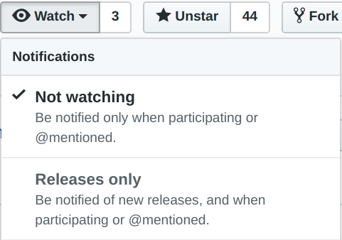

# Getting Started

It doesn't take much to get `stata_kernel` up and running. Here's how:

## Prerequisites

- **Stata**. A currently-licensed version of Stata must already be installed. `stata_kernel` has been reported to work with at least Stata 13+, and may work with Stata 12.
- **Python**. In order to install the kernel, Python 3.5, 3.6, or 3.7 needs to be installed on the computer on which Stata is running.

    I suggest installing the [Anaconda
    distribution](https://www.anaconda.com/download/). This doesn't require
    administrator privileges, and is the simplest way to install Python and many of the most popular scientific packages.

    The full Anaconda installation is quite large, and includes many libraries for Python that
    `stata_kernel` doesn't use. If you don't plan to use Python and want to use
    less disk space, install [Miniconda](https://conda.io/miniconda.html), a bare-bones version of Anaconda. Then when [installing the package](#package-install) any other necessary dependencies will be
    downloaded automatically.

???+ note "Windows-specific steps"

    In order to let `stata_kernel` talk to Stata, you need to [link the Stata Automation library](https://www.stata.com/automation/#install):

    1. In the installation directory (most likely `C:\Program Files (x86)\Stata15` or similar), right-click on the Stata executable, for example, `StataSE.exe`. Choose `Create Shortcut`. Placing it on the Desktop is fine.
    2. Right-click on the newly created `Shortcut to StataSE.exe`, choose `Property`, and append `/Register` to the end of the Target field. So if the target is currently `"C:\Program Files\Stata15\StataSE.exe"`, change it to `"C:\Program Files\Stata15\StataSE.exe" /Register`. Click `OK`.
    3. Right-click on the updated `Shortcut to StataSE.exe`; choose `Run as administrator`.

## Package Install

To install the kernel, from a terminal or command prompt run:

```bash
pip install stata_kernel
python -m stata_kernel.install
```

If Python 2 is the default version of Python on your system, you may need to use
```bash
pip3 install stata_kernel
python3 -m stata_kernel.install
```

In order to get syntax highlighting in Jupyter Lab, run:
```bash
conda install -c conda-forge nodejs -y
jupyter labextension install jupyterlab-stata-highlight
```

If you didn't install Python from Anaconda, the `conda` command won't work and you'll need to install [Node.js](https://nodejs.org/en/download/) directly before running `jupyter labextension install`.

### Upgrading

To upgrade from a previous version of `stata_kernel`, from a terminal or command prompt run

```
pip install stata_kernel --upgrade
```

When upgrading, you don't have to run `python -m stata_kernel.install` again.

#### Release notifications

If you'd like to be notified when a new version of `stata_kernel` is released,
you can [create a GitHub account](https://github.com/join), then go to [the
project homepage](https://github.com/kylebarron/stata_kernel), and in the top
right, click "Watch" and select "Releases Only".



While you're there, click "Star" as well! :blush:

## Using

Next, read more about [Jupyter and its different
interfaces](using_jupyter/intro.md) or about [how to use the Stata
kernel](using_stata_kernel/intro.md), specifically.
