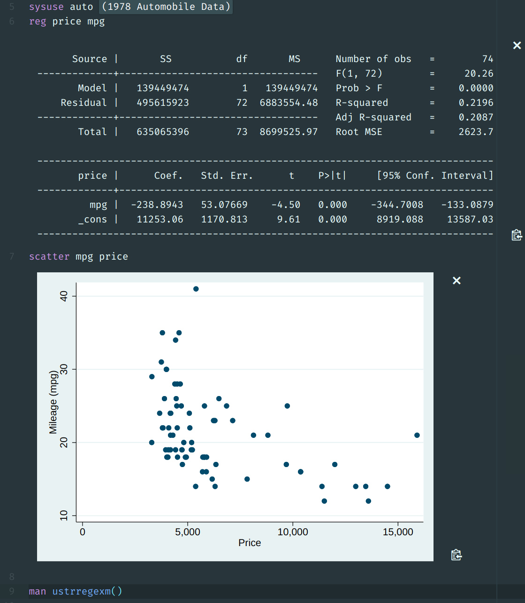

# stata_kernel

`stata_kernel` is a Jupyter kernel for Stata; It works on Windows, macOS, and
Linux.

## What is Jupyter?

Jupyter is an open-source ecosystem for interactive data science. Originally developed around Python, Jupyter has grown to interface with dozens of programming languages. `stata_kernel`
is the bridge that interactively connects Stata to all the elements in the ecosystem.

- The **Jupyter Notebook** allows for interweaving of code, text, and results.

    - Splice models in LaTeX math mode with the code that implements them and the graphs depicting their output.
    - Jupyter Notebooks can be exported as PDFs or HTML, and are as good for teaching new students as they are for displaying research results.
    - Use Stata in the same document with R, Python, or Julia code.

- The **Jupyter console** is an enhanced interactive console. Its features include enhanced autocompletion, better searching of history, syntax highlighting, among others.
- **Hydrogen** is a package for the Atom text editor that connects with Jupyter kernels to display results interactively in your text editor.
- Enhanced remote work. You can set up Jupyter to run computations remotely but to show results locally, vastly enhancing productivity compared to working with the Stata console through a command line.

Atom             |  Jupyter Notebook
:-------------------------:|:-------------------------:
    |  

## Features

`stata_kernel` is undergoing active development, and not all of the features have been completed. You may find bugs in the program still. If you do, please [submit a bug report](https://github.com/kylebarron/stata_kernel/issues/new?template=bug_report.md).

- [x] Supports Windows, macOS, and Linux.
- [x] Works with Jupyter Notebook and Atom's Hydrogen package
- [x] Allows for inline and block comments.
- [x] Display graphs (still working out limitations)
- [x] Work with a remote session of Stata
- [ ] Receive results as they appear, not after the entire command finishes.
- [x] Special shorthand "magics" to aid with, for example benchmarking code.
- [ ] Autocompletions as you type based on the variables, macros, and return objects currently in memory.
- [ ] Mata interactive support
- [ ] `#delimit ;` support.
- [ ] Cross-session history file
- [ ] Pull up help files within the kernel.
