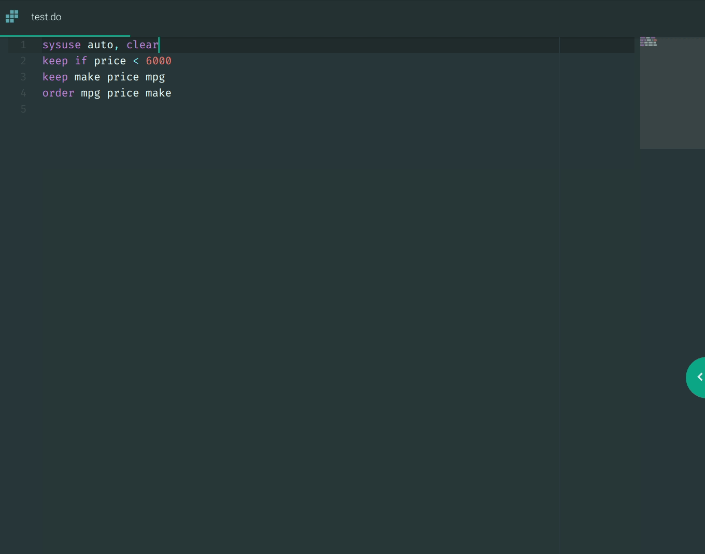

# Hydrogen in Atom

Hydrogen is a package for the Atom text editor that connects with Jupyter kernels, such as `stata_kernel`, to display results interactively inside the text editor.

## Installation

Download the [Atom text editor](https://atom.io) and install two add-on packages (go to Preferences > Settings or type <kbd>Ctrl</kbd>+<kbd>,</kbd> (<kbd>Cmd</kbd>-<kbd>,</kbd> on macOS), then click Install):

- [Hydrogen](https://atom.io/packages/hydrogen): this connects to Jupyter kernels and allows you to view results in-line next to your code. You can use it with Python, R, and Julia, as well as Stata.
- [language-stata](https://atom.io/packages/language-stata): this provides syntax highlighting for Stata code and is necessary so that Hydrogen knows to connect to Stata, and not to something else.

Once those are installed, open a do-file and run <kbd>Ctrl</kbd>-<kbd>Enter</kbd> (<kbd>Cmd</kbd>-<kbd>Enter</kbd> on macOS) to start the Stata kernel.

Below is a quick rundown of Hydrogen's capabilities. For more information, see [Hydrogen's documentation](https://nteract.gitbooks.io/hydrogen/docs/Usage/GettingStarted.html).

## Running code

There are three main ways to run code using Hydrogen:

- Selection. Manually select/highlight the lines you want to send to Stata and then run `Hydrogen: Run`, which is usually bound to <kbd>Ctrl</kbd>-<kbd>Enter</kbd>.
- Cursor block. When `Hydrogen: Run` is called and no code is selected, Hydrogen runs the current line. If code following the present line is more indented than the current line, Hydrogen will run the entire indented block.
- Cell. A cell is a block of lines to be executed at once. They are defined using `%%` inside comments. See [here](https://nteract.gitbooks.io/hydrogen/docs/Usage/GettingStarted.html#hydrogen-run-cell) for more information.

### Output

Output will display directly beside or beneath the block of code that was
selected to be run. Code that does not produce any output will show a check mark
when completed.

### Watch Expressions

Hydrogen allows for [_watch expressions_](https://nteract.gitbooks.io/hydrogen/docs/Usage/GettingStarted.html#watch-expressions). These are expressions that are automatically re-run after every command sent to the kernel. This is convenient for viewing regression output, graphs, or the data set after changing a parameter.

Note that since the watch expression is run after _every_ command, it shouldn't be something that changes the state of the data. For example, `replace mpg = mpg * 2` would be unwise to set as a watch expression because that would change the column's data after every command.

Using watch expressions with a graph:


Using watch expressions to browse data:


## Indentation and for loops

Stata `foreach` loops and programs must be sent as a whole to the kernel. The
easiest way to make sure that this happens is to indent all code pertaining to
the block. Starting in version 1.6.4 of `language-stata`, this will
automatically include the last line of a for loop or program even if that last
line has the same indentation as the initial line.

If the cursor is anywhere on the first line in the segment below, and you run
<kbd>Ctrl</kbd>-<kbd>Enter</kbd> or <kbd>Shift</kbd>-<kbd>Enter</kbd> (which
moves your cursor to the next line), it will include the final `}`.

```stata
foreach i in 1 2 3 4 {
    display "`i'"
}
```
