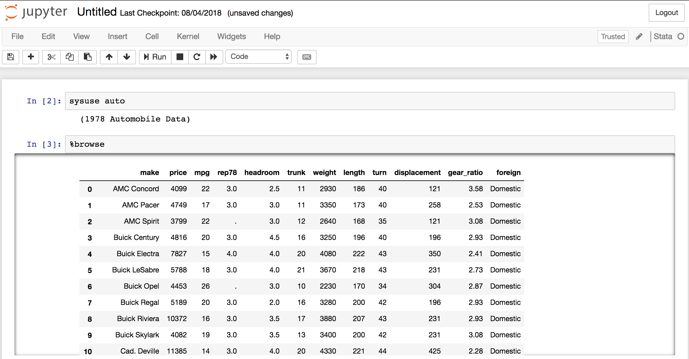

# Magics

**Magics** are programs provided by `stata_kernel` that enhance the experience of working with Stata in Jupyter.

All magics are special commands that start with `%`. They must be the first word of the cell or selection, otherwise they won't be intercepted and will be sent to Stata.

## `%browse`

**Interactively view your dataset**

For now, this displays the first 200 rows of your data. This will be expanded in the future to allow for a `varlist`, `if`, and `in` options.

| | |
|:-------------------------:|:-------------------------:|
| **Atom** |  |
| **Jupyter Notebook** |   |

<!-- ## `%plot`

**Force Plot to Show**

In most cases, `stata_kernel` is able to see that you're creating a graph, and will correctly display it. However if you're running a program and a graph is created within the program, you may have to nudge the kernel to show the graph. You can do that with `%plot`.

```stata
program define make_scatter_plot
    sysuse auto
    scatter price mpg
end

%plot make_scatter_plot
```


You can provide options after `%plot` and before code:

```
usage: %plot [-h] [--scale SCALE] [--width WIDTH] [--height HEIGHT] [--set]
             [CODE [CODE ...]]
```

- `-h` or `--help`: show help menu for `%plot`
- `--scale`: Scale default height and width. Defaults to 1.
- `--width`: Plot width in pixels. Defaults to 600px.
- `--height`: Plot height in pixels. Defaults to 400px.
- `--set`: Set plot width and height for the rest of the session. -->

## `%locals`

**List Local Macros**

## `%globals`

**List Global Macros**

<!-- ## `%time`

**Time Execution of a Command**

This timing is currently most exact on macOS and Linux using the console method of speaking to Stata. It may be redeveloped in the future to use Stata's `rmsg` option.

```stata
%time sleep 100
``` -->
